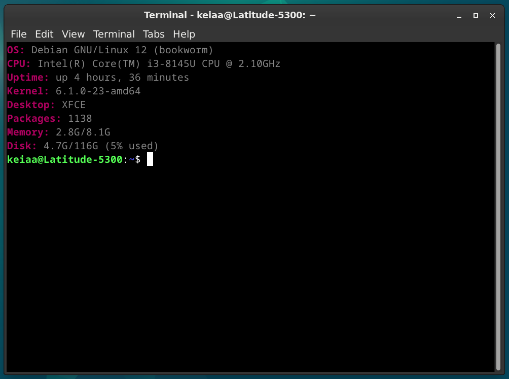

# AnotherFetch

AnotherFetch is yet another fetch script, which focuses on simplicity and minimalism. It aims to be a noob-friendly, drop-in replacement for Neofetch and screenFetch. With around 30 lines of code, it aims to display system information in a neat and legible manner.



## Credits

- argwyll
- imdakila
- atrval
- alitaj786
- shige

## Instructions

It can be used by simply appending the contents of the `anotherfetch.sh` to your `.bashrc`. It can also replace it entirely, but may remove certain terminal features.

```
nano .bashrc
```

---

## What is `.bashrc`?

`.bashrc` is a configuration file for the Bash shell, which is a Unix shell and command-line interpreter. 

The .bashrc file is usually located in your home directory (~/.bashrc) and is read by Bash when it starts up. The file is used to customize your shell environment, set environment variables, and define aliases, functions, and other shell settings.

---

## What does this script do?

The script initially **defines the colors** to be used later, which goes as follows;

```
# First Section - Colors

red='\e[1m\e[38;5;125m'
reset='\e[0m\e[38;5;102m'
```

The characters within single quotes (`'`) are *ANSI color escape sequences*. To put it simply, they're similar to color hex and RGB values. This is not entirely necessary, but is added for neatness and eligibility.

If you happen to be interested in modifying the values of above variables, please consult this [resource](https://stackoverflow.com/questions/4842424/list-of-ansi-color-escape-sequences).

Then, the important part comes, which is to **gather the necessary information**. It simply defined variables with values of certain commands I find useful to fetch such details. It goes as follows;

```
# Second Section - Gather system information

os=$(lsb_release -ds)
kernel=$(uname -r)
de=$(echo $XDG_CURRENT_DESKTOP)
uptime=$(uptime -p)
packages=$(dpkg -l | grep -c '^ii')
cpu=$(grep -m1 'model name' /proc/cpuinfo | cut -d: -f2 | xargs)
memory=$(free -h --si | awk '/Mem:/ {print $3 "/" $2}')
disk=$(df -h / | awk '/\// {print $3 "/" $2 " (" $5 " used)"}')
```

It is all but a set of variables on their own, so it needs to be run. To put in an analogy, it's like an intent, but no actions yet. There's no need to elaborate on the commands as the variable names are pretty self-explanatory. So, comes the third part which focuses on **printing the information in a legible, organized manner**. It goes as follows;

```
# Third Section - Display Information

echo -e "${red}OS: ${reset}$os"
echo -e "${red}CPU: ${reset}$cpu"
echo -e "${red}Uptime: ${reset}$uptime"
echo -e "${red}Kernel: ${reset}$kernel"
echo -e "${red}Desktop: ${reset}$de"
echo -e "${red}Packages: ${reset}$packages"
echo -e "${red}Memory: ${reset}$memory"
echo -e "${red}Disk: ${reset}$disk"
```

`echo` is a command in Unix-like operating systems that outputs its argument(s) to the standard output, usually the terminal screen. When combined with a `-e` modifier, it enables the interpretation of backslash escapes. Here, it's used to allow the interpretation of ANSI escape codes earlier to set color variables to the text.

`${red}` and `${reset}` applies the earlier color variables to the texts suceeding them. On the other hand, the methods like `$os` calls the variables defined in the second code section.

---

## Notes

### Package Count

The package counter feature of this script is only for .deb packages. If you use other package formats, please replace `dpkg -l | grep -c '^ii'` with the following. 

You can add another variable though, if you don't want to remove the said command.

**Flatpak:**

```
flatpak=$(flatpak list | wc -l)
resultfp=$((flatpak-1))

echo -e "${red}Flatpak: ${reset}$resultfp"
```

**Snaps:**

```
snap=$(snap list | wc -l)
resultsp$((snap-1))

echo -e "${red}Snap: ${reset}$resultfp"
```

**AUR (YAY)**

```
yay=$(yay -Q | wc -l)

echo -e "${red}AUR: ${reset}$yay"
```

**DNF**

```
dnf=$(dnf list installed | wc -l)
resultdnf=$((dnf-1))

echo -e "${red}DNF: ${reset}$resultdnf"
```

---

### Temperature

For certain reasons, you might want to add a temperature feature. This is not built-in to the script as thermal-related directories/entries may vary per device. You can find these thermal data in `/sys/class/thermal/`.

You may see directories named `cooling_device*` or `thermal_zone*`. You can open each and every one of them to check on the `type` file. It will show an info regarding what sensor might be handling the said readings (i.e. acpitz, pch_cannonlake).

Feel free to use any of them by modifying this entry. I suggest opting for `acpitz` (often thermal_zone0) on such readings.

```
temp=$(cat /sys/class/thermal/thermal_zone0/temp | awk '{ print ($1 / 1000) "°C" }')
```

Then, add the following entry to the third section.

```
echo -e "${red}Temperature: ${reset}$temp"
```

---

### IP Address

To add IP Address in AnotherFetch, simply add the following entries.

```
ip=$(hostname -I)

echo -e "${red}IP: ${reset}$ip"
```

---

Thanks for your interest in AnotherFetch! If you have some questions or feedback, please feel free to message me on Discord (@nozomimimimi).
